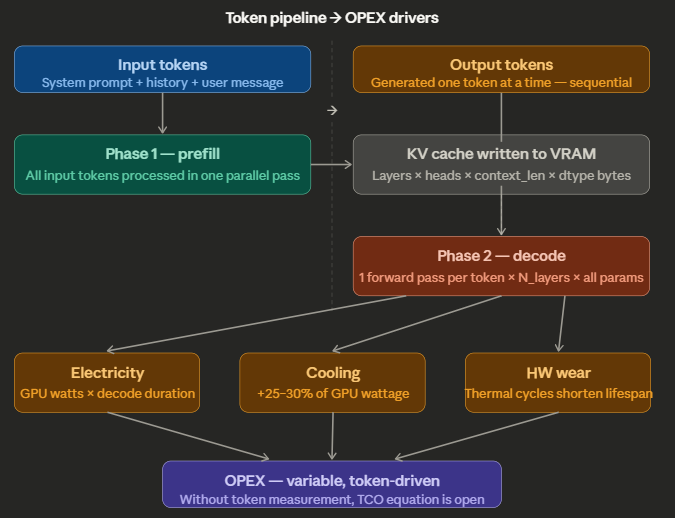

# Tokens Are Not Free: How Every Token Generated Drives Real Operating Cost

## Introduction

When organizations deploy large language models — whether through cloud APIs or on local GPU hardware — the conversation around cost almost always gravitates toward infrastructure. How many GPUs? What instance type? What cloud provider? These are legitimate questions, but they are incomplete. The most useful accounting unit in an LLM deployment is not the server, the API call, or the hour of compute. It is the **token**.

That is not a billing abstraction imposed by vendors for convenience. Tokens are the operational unit through which transformer-based language models consume compute, and the cost of processing them is real, measurable, and cumulative. Every token in the system prompt is processed on every call. Every output token requires another decode step through the model. Those steps consume GPU cycles, draw electrical power, generate heat, and contribute to hardware wear.

On cloud infrastructure, that cost is visible on the invoice. On local GPU infrastructure, it is embedded in the electricity bill, the cooling system load, and the hardware replacement cycle. The mechanism is identical. Only the ledger entry differs.

Organizations that measure token consumption only on cloud calls and treat local inference as a fixed-cost resource are operating with an incomplete cost model. They cannot optimize what they do not measure, and they cannot make sound infrastructure decisions without a complete picture of where cost actually originates. Token accounting on local inference is not sufficient by itself, but it is an essential financial control instrument and belongs in any serious TCO analysis of local LLM deployment.

To see why, it helps to look inside how a transformer actually works, because the economics of token generation follow directly from the architecture.

## Executive Summary

- Tokens are the most useful unit for attributing LLM inference cost because both cloud billing and local GPU work ultimately scale with how much text the model processes and generates.
- Input tokens and output tokens are not processed the same way: input-heavy workloads spend more on prefill, while chatty workloads often spend more on sequential decode.
- Local inference is not "free after purchase." Electricity, cooling, and hardware wear still scale with workload intensity, and token counts are one of the clearest signals of that demand.
- Token accounting alone is not a full cost model, but without it, TCO analysis for local inference is materially incomplete.

---

## What Is a Token?

A token is the smallest unit of text that a language model processes. It is neither a character nor a word — it sits somewhere between the two. In English, the average token corresponds to roughly four characters or three-quarters of a word. Under common English-oriented tokenizers, the word "infrastructure" may split into two tokens and "MikroTik" into several. A typical twenty-word sentence is often about twenty-five to thirty tokens.

Every interaction with an LLM involves two categories of tokens:

**Input tokens** — everything the model reads before generating a single word. This includes the system prompt (the standing instructions that define the model's behavior), the conversation history (every prior turn in the session), any retrieved documents injected via RAG, and the user's current message. In production systems with rich system prompts and multi-turn histories, input tokens routinely reach five thousand to twenty thousand tokens per call — before the model has said a word.

**Output tokens** — everything the model generates in response. These are produced one at a time, sequentially. In many interactive workloads they are the most expensive tokens because decode is inherently serial, though very long inputs can also make prefill expensive.

That distinction matters for cost accounting because the model processes those two categories differently.

---

## How a Transformer Generates Tokens

Modern language models — GPT, Gemma, Mistral, Claude — are built on the transformer architecture. To understand why tokens drive cost, you need a basic mental model of what happens inside the network each time it produces one. Representative sources for the mechanics discussed in this section are listed in the source notes at the end.[1][2]

### The Forward Pass

Generating a token requires one complete **forward pass** through the model. A forward pass is the mathematical path a representation of text takes from the input layer to the output layer. For a 7-billion-parameter model like Mistral 7B, that means moving through roughly thirty-two transformer layers in sequence. For a 70-billion-parameter model, that number rises to about eighty. Each layer performs two expensive operations: **multi-head self-attention** and a **feed-forward network (FFN)** transformation.

The attention mechanism is where the model decides which parts of the input are relevant to what it is currently generating. In a standard full-attention transformer, tokens in the context window compute weighted relationships through the learned query, key, and value projections. In that setting, attention work during prefill scales roughly with the **square of the context length**. Double the context, and the attention component of prefill grows by about four times.

The FFN then transforms the attended representation through two large matrix multiplications before passing it to the next layer. Across dozens of layers, those matrix multiplications account for the majority of GPU FLOP consumption per token.

### Two Phases: Prefill and Decode

Token generation is not a single uniform process. It has two mechanically distinct phases.

**Prefill** is the processing of all input tokens. During prefill, the GPU processes the prompt in parallelized batches, which is why modern accelerators can absorb large prompts efficiently. The output of prefill is the KV cache. For many chat workloads, prefill is a brief burst relative to decode. With very long prompts or large retrieved contexts, however, it can become a major share of the cost.

**Decode** is the generation of output tokens. Here the model generates exactly one token per forward pass, and it cannot generate the next token until the current one is complete. This is inherently sequential — there is no parallelism to exploit across output tokens. Each decode step requires a full forward pass through all layers of the model. A five-hundred-token response requires five hundred sequential forward passes.

This asymmetry is a major reason cloud APIs often price output tokens above input tokens. On local hardware, it means decode usually dominates latency for chatty workloads, even though total cost still depends on both prefill and decode.

### The KV Cache

During prefill, the model computes key and value matrices for every input token and stores them in GPU memory — the KV cache. During decode, each new token can attend to these cached values without recomputing them, which dramatically reduces the cost of each decode step compared to recomputing attention from scratch.

However, the KV cache is not free. Its memory footprint scales with the number of layers, batch size, context length, KV width, and element size. A useful approximation is `2 × layers × batch × context_length × kv_heads × head_dim × data_type_bytes`, where the factor of 2 accounts for both keys and values. A 70B model with a very large context window can require tens of gigabytes of VRAM for KV cache alone. That leaves less room for model weights, forces quantization or smaller batch sizes, and compresses throughput.

---



## How Tokens Become OPEX

On a cloud API, the cost model is explicit: you are billed per million input tokens and per million output tokens, with output often carrying a rate two to five times higher than input. The invoice is visible, line-itemed, and attributable.[3][4]

On local GPU hardware, the cost model has the same underlying driver but is expressed in different units. There is no invoice from a vendor. Instead, the cost appears as electricity consumption, cooling load, and hardware wear — all driven by how much inference work the GPU performs, which in practice is strongly influenced by prompt length, output length, model size, batching, and throughput.

### Electricity

GPU power draw is not constant. Under idle conditions, an inference GPU like a Tesla P40 may draw a few dozen watts. Under sustained inference load, it can draw several hundred watts. Token processing is what moves the card from one regime to the other. Exact figures vary by board, system design, and workload.

During prefill, the GPU may run at high utilization for a short burst. During decode, each sequential forward pass sustains meaningful load for its duration. The total energy consumed per response is therefore a function of both prefill time and decode time, multiplied by the system's average power draw under that workload.

```math
Electricity cost per call ≈ (prefill_time + decode_time) × (avg_GPU_watts / 1000) × price_per_kWh
```

At fifty decode tokens per second on a 250-watt GPU and $0.12 per kilowatt-hour, a five-hundred-token response with roughly ten seconds of decode time costs about $0.00008 in electricity before adding prefill and cooling overhead. That figure appears negligible in isolation. Across ten thousand calls per day, even a small per-call energy cost becomes a visible operating expense.

### Cooling

Every watt the GPU dissipates becomes heat that must be removed. In a rack environment, cooling overhead typically adds twenty to thirty percent to the electrical cost of the compute it supports. This is not a fixed cost. It scales with utilization, which scales with inference workload.

### Hardware Wear and Lifespan

GPUs are not indefinitely durable. Sustained high utilization — high temperature, thermal cycling, memory pressure — accelerates electromigration in the silicon and degrades solder joints over time. A GPU driven hard by inference workloads will reach end of life faster than the same GPU at moderate utilization. The amortization schedule for hardware is therefore not purely a function of calendar time; it is also affected by workload intensity and operating conditions.

### Memory Bandwidth and Throughput Collapse

Older cards like the P40 use GDDR5 memory rather than the HBM-class memory found in newer data-center GPUs. That lower memory bandwidth often becomes a bottleneck during decode. In practice, decode for large models is frequently memory-bandwidth-bound because weights must be streamed through the GPU memory hierarchy for each token step. At large context windows, the KV cache also consumes VRAM and can reduce effective throughput by constraining batching or forcing more aggressive quantization. Slower throughput means each generated token takes longer to produce, keeping the system under load for longer.

### Reasoning Models and the Hidden Token Problem

Some models — including extended-thinking variants and openly reasoning models like DeepSeek-R1 — may generate substantial intermediate reasoning before producing the final response. Depending on the model and provider, those internal steps may not be surfaced to the user even though they still consume compute. Operationally, that means a response that looks short at the API boundary may still have required far more generation work underneath.

---

## Why Token Accounting Must Be Part of OPEX

The argument occasionally made against including token generation in local OPEX accounting rests on a single premise: the hardware has already been paid for. This confuses capital expenditure with operating expenditure.

Capital expenditure is the one-time cost of acquiring the GPU. It is sunk at the moment of purchase. Operating expenditure is the recurring cost of running the GPU — electricity, cooling, maintenance, and replacement. These costs occur every month, every day, every call. They do not vanish because the hardware was bought outright.

Token volume is one of the primary variables that drives the variable component of local OPEX. Hardware depreciation is often modeled on a calendar schedule. Staff costs are mostly fixed. Rack space is mostly fixed. But electricity consumption, cooling load, and wear rate vary with how hard the GPU is working, which is strongly influenced by how many input and output tokens it is processing, how large the model is, and how efficiently the workload is batched.

Without per-token cost accounting on local infrastructure, the electricity and cooling line items in the operating budget become unexplained aggregates. Finance cannot attribute them to workloads. Engineering cannot optimize them. Leadership cannot compare the true cost of a local inference call against a cloud API call and make rational build-versus-buy decisions.

The unified cost formula that closes the TCO model requires token measurement at every layer:

```math
\begin{aligned}
Cloud\ OPEX &= \left(\frac{input\_tokens}{10^6} \times input\_rate\right) + \left(\frac{output\_tokens}{10^6} \times output\_rate\right) \\
Local\ OPEX &\approx (prefill\_time + decode\_time) \times \left(\frac{avg\_system\_watts}{1000}\right) \times \$/kWh + cooling\_overhead + hardware\_amortization \\
Total\ TCO &= CapEx\ (hardware) + \sum Local\ OPEX + \sum Cloud\ OPEX + Staff + Facilities
\end{aligned}
```

The local OPEX row is heavily influenced by token-driven workload characteristics even though tokens are not the only parameter. Removing token measurement from this model does not simplify the accounting; it leaves one of the main demand signals unmeasured.

## If You Run the Model on AWS Instead

Self-hosting an LLM on AWS changes the accounting, but not the underlying logic. You are still paying for inference work. The difference is that electricity, cooling, and most hardware lifecycle costs are embedded in the cloud bill instead of appearing as separate local operating expenses. For a self-managed deployment on Amazon EC2, the cost model is usually built from five parts: compute instance time, attached storage, networking, load balancing, and observability or platform overhead.[6][7][8]

A practical monthly formula looks like this:

```math
AWS self-hosted LLM cost
\approx (EC2\ instance\ hours \times instance\ rate)
+ (EBS\ GB\text{-}month \times storage\ rate)
+ (extra\ EBS\ IOPS/throughput\ charges)
+ (load\ balancer\ hours + LCU/NLCU\ usage)
+ (data\ transfer\ out\ to\ internet)
+ (public\ IPv4,\ snapshots,\ monitoring,\ and\ other\ service\ charges)
```

If you want a per-call estimate, divide the monthly infrastructure cost by the number of calls actually served, or better, allocate it by consumed GPU-seconds and token volume:

```math
Per\ call\ AWS\ cost
\approx \frac{monthly\ infrastructure\ cost}{monthly\ calls}
\quad or \quad
\frac{request\ GPU\ time}{total\ billable\ GPU\ time} \times monthly\ infrastructure\ cost
```

In practice, the dominant term is usually the GPU instance itself. EC2 On-Demand pricing is billed per instance-second or instance-hour depending on the platform, and that compute charge replaces the explicit electricity equation used for on-prem hardware.[6] EBS then adds storage charges, and for some volume types may also add separate charges for provisioned IOPS and throughput.[7] If you front the service with an Application Load Balancer or Network Load Balancer, you pay both for running hours and for usage units such as LCUs or NLCUs.[8] If responses leave AWS and go to users over the public internet, data transfer out can become material at scale.[6]

The conceptual bridge back to token accounting is straightforward. On AWS, tokens still drive the amount of inference work your system performs. More prompt tokens increase prefill work. More generated tokens increase decode time. Those factors reduce effective throughput, increase required instance hours, and therefore raise the EC2 portion of the bill. So even in AWS, the infrastructure bill is not separate from token economics. It is simply a different ledger expression of the same workload.

## Distributed Inference and the Networking Penalty

Once a model no longer fits comfortably on one device, inference stops being only a compute-and-memory problem and becomes a networking problem as well. Tensor parallelism, pipeline parallelism, and other distributed inference strategies split work across multiple GPUs or nodes, which means intermediate activations, partial results, or KV-related state must be exchanged across the interconnect.[10]

That matters economically because distributed inference adds a new OPEX term that does not exist in the same way for a single-card deployment:

```math
Distributed\ inference\ OPEX
\approx compute
+ storage
+ interconnect\ and\ east\text{-}west\ networking
+ synchronization\ overhead
+ underutilization\ caused\ by\ communication\ stalls
```

In practical deployments, the networking cost can rise very sharply as the model is spread across more devices. The reason is not that networking is universally exponential in a strict mathematical sense. It is that each scaling step can increase traffic between devices, force a move to a higher-bandwidth fabric, and reduce effective utilization if the interconnect is too slow. Operationally, that can look exponential because the spend curve steepens quickly once you cross the boundary from single-node inference to multi-node coordination.

Tensor parallelism is a concrete example. When a layer is sharded across GPUs, partial outputs must be transferred and recombined to produce the final result.[10] On a single machine, this may be handled by NVLink, PCIe, or another high-speed local fabric. Across machines, the same pattern may traverse much more expensive east-west networking, where both latency and bandwidth become limiting factors. In cloud environments, this can also introduce explicit transfer charges or force the use of more expensive instance classes and network topologies.[6]

The cost impact shows up in three ways:

- More bandwidth demand: larger models and more shards mean more cross-device traffic.
- More idle time: GPUs wait on collective communication and synchronization instead of generating tokens.
- More infrastructure spend: you may need premium networking, tightly coupled instance families, or placement constraints just to keep throughput acceptable.

So distributed inference does not break the token-cost thesis; it reinforces it. More tokens still mean more work. But once that work is distributed, every token may also trigger more communication across the fabric. At that point, the marginal cost of a token is no longer just compute and memory access. It is compute, memory, and the bandwidth required to keep the distributed system synchronized.

## Where Amazon Bedrock Fits

Amazon Bedrock sits in a different part of the stack from self-hosting on EC2. With EC2, you rent infrastructure and run the model yourself. With Bedrock, AWS exposes managed foundation models as an API service. That means the cost model looks much closer to OpenAI or Anthropic API billing than to operating your own inference fleet.[9]

For standard on-demand text inference, the practical Bedrock formula is usually:

```math
Bedrock\ on\text{-}demand\ cost
\approx (input\ tokens \times input\ rate)
+ (output\ tokens \times output\ rate)
+ optional\ Bedrock\ add\text{-}ons
```

Those add-ons can matter. Depending on the architecture, the total bill may also include Bedrock Guardrails, Knowledge Bases, Flows, model evaluation, prompt optimization, batch inference, or other Bedrock-managed features.[9] In other words, Bedrock often preserves token-based charging for the model invocation itself, while separately charging for orchestration or safety features wrapped around it.

Bedrock also supports pricing modes beyond simple on-demand token billing. Some models support provisioned throughput, where you reserve model capacity and pay for committed model units over time. In that case, the cost model starts to look more like reserved serving capacity than pure per-token API billing. Bedrock also offers batch inference for some models at lower prices than standard on-demand usage.[9]

The practical distinction is this:

- Self-hosted on EC2: you pay primarily for infrastructure time, and tokens affect cost indirectly by consuming more GPU time.
- Bedrock on-demand: you pay primarily for model usage, and tokens affect cost directly through metered input and output rates.
- Bedrock provisioned throughput: you pay for reserved model capacity, with token volume determining how efficiently you use what you reserved.

So if this article is drawing a full decision tree, AWS now has two separate branches. One branch is "run the model yourself on EC2," where token volume translates into instance-hours, storage, and networking. The other is "consume a managed model through Bedrock," where token volume shows up directly in the Bedrock invoice much like any other hosted model API.

---

## Conclusion

The comparison below puts the four operating models side by side under the same question: what are you paying for, what are the dominant challenges, and what does 24x7 operation actually imply financially? The dollar figures are illustrative, not quoted offers. To keep the comparison grounded, assume a representative monthly workload of 100 million input tokens and 20 million output tokens for token-metered services, one continuously running GPU-class EC2 deployment, and a local 7× Tesla P40 rig drawing roughly 2.05 kW at the wall with 24-month straight-line hardware amortization. For the 3-year TCO row, also include a modest application and service layer budget of about $150/month in all four cases, about $1,000 of integration and setup for managed APIs, about $2,500 for EC2 self-hosting, and about $3,000-$4,500 of local infrastructure setup plus a 25/100 GbE-class switch in the $800-$1,500 range for the distributed on-prem rig. The 2-year ROI row is expressed relative to staying on the generic cloud API for the same workload, with common application-layer costs treated as broadly equal across options. These calculations are based on data gathered through experimentation and should be treated as directional estimates that may vary materially with workload shape, model choice, serving stack, and utilization.

| Comparison point                   | Generic cloud API                                                                                  | AWS EC2 self-hosted                                                                                                         | Amazon Bedrock                                                                                                                | Local rig with 7× Tesla P40                                                                                                                                     |
| ---------------------------------- | -------------------------------------------------------------------------------------------------- | --------------------------------------------------------------------------------------------------------------------------- | ----------------------------------------------------------------------------------------------------------------------------- | --------------------------------------------------------------------------------------------------------------------------------------------------------------- |
| What you pay for operationally     | Metered input and output tokens                                                                    | GPU instance hours, storage, networking, load balancing, monitoring                                                         | Managed model usage, plus optional Bedrock features                                                                           | Electricity, cooling, maintenance, and hardware amortization                                                                                                    |
| Estimated CAPEX                    | None in the customer environment                                                                   | None in the customer environment                                                                                            | None in the customer environment                                                                                              | Roughly $3,500-$5,500 up front for used GPUs, host, storage, networking, and power headroom                                                                     |
| Estimated OPEX                     | About $550/month for 100M input and 20M output tokens using a GPT-5.4-class published rate example | Roughly $1,500-$3,000/month for a 24x7 GPU instance before full storage, networking, and transfer overhead                  | About $1,280/month for 100M input and 20M output tokens using Bedrock Claude-class example rates, before add-ons              | About $118/month in electricity alone at 2.05 kW and $0.08/kWh; roughly $300-$400/month once cooling and amortization are included                              |
| Distributed inferencing challenges | Mostly abstracted away by provider                                                                 | Cross-instance latency, east-west traffic, storage throughput, placement, and premium networking requirements               | Mostly abstracted at the infrastructure layer, but service quotas, feature overhead, and provisioned-capacity planning remain | Inter-GPU coordination, storage feed rate, memory bandwidth, shard placement, and network bottlenecks between inference server and NVMe                         |
| Throughput constraint              | Vendor-side serving stack and model limits                                                         | GPU throughput, storage path, and east-west networking                                                                      | Service tier, model quota, and Bedrock feature overhead                                                                       | VRAM limits, memory bandwidth, inter-GPU coordination, and storage feed rate                                                                                    |
| Total cost for running 24x7 on GPU | About $550/month for the illustrative workload, but scales linearly with token volume              | Roughly $1,700-$3,500/month once storage, transfer, and support services are included                                       | About $1,280/month for the same illustrative workload, rising with Guardrails, Knowledge Bases, or provisioned throughput     | Roughly $300-$400/month in direct operating cost, excluding labor, downtime risk, and spare capacity                                                            |
| 3yr TCO $                          | About `$26,000` over three years once token spend, the app layer, and setup are included           | Roughly `$69,000-$134,000` over three years once compute, storage, networking overhead, app hosting, and setup are included | About `$52,000` over three years once model usage, app hosting, and setup are included, before premium add-ons                | Roughly `$23,000-$31,000` over three years including AI server hardware, network switch, rack and power setup, app hosting, and ongoing electricity and cooling |
| 2yr ROI                            | Baseline reference at this workload                                                                | Negative versus the cloud-API baseline at medium utilization; the extra infrastructure spend is not recovered in two years  | Negative versus the cloud-API baseline at this workload unless AWS-native integration value dominates cost                    | Near break-even to modestly positive only if utilization stays high and the hardware, switch, and setup costs are tightly controlled                            |
| Practical note                     | Simplest accounting model. Token cost is explicit on the invoice.                                  | Tokens affect cost indirectly by increasing required instance time.                                                         | Economically close to a hosted API, but with AWS-native orchestration options.                                                | Cheapest-looking power bill is not the full story; throughput depends heavily on storage and interconnect design.                                               |

> The point of the table is not that all four numbers are identical. It is that they are different expressions of the same compute physics. Cloud API and Bedrock make cost explicit in token billing. EC2 hides it in rented infrastructure time. Local rigs hide it in power, cooling, amortization, and operator responsibility. Once you normalize for workload and utilization, all four approaches begin converging toward the same underlying economics: moving tokens through large transformer stacks is expensive no matter where you run them.

For the last row in particular, distributed inference on a 7× P40 system only works well if the data path feeding the model is fast enough. Once weights, shards, KV-related state, or retrieval artifacts are streamed across the storage path, insufficient bandwidth quickly turns the rig into a waiting system instead of a compute system. As a practical floor, if you are trying to approach cloud-like token rates on larger models, you should treat anything below the 25 Gbps class between the inference server and NVMe-backed storage as a bottleneck risk, not as a comfortable operating margin. Above that point, the exact requirement still depends on model size, quantization, sharding strategy, and whether the NVMe is local, disaggregated, or network-attached, but the general principle is consistent: distributed inference performance is limited as much by how fast you can feed the GPUs as by the GPUs themselves.

## Source Notes

1. Vaswani et al., _Attention Is All You Need_ (2017). Canonical reference for the transformer architecture and the role of self-attention: https://arxiv.org/abs/1706.03762
2. Hugging Face Transformers documentation, _Caching_. Practical explanation of KV caching during autoregressive inference, including cache structure and why caching avoids recomputing prior keys and values: https://huggingface.co/docs/transformers/main/cache_explanation
3. OpenAI API Pricing. Current example of distinct input-token and output-token pricing on a major commercial API: https://openai.com/api/pricing/
4. Claude API Pricing. Another current example of distinct input-token and output-token pricing on a major commercial API: https://claude.com/pricing#api
5. Hardware figures in this article are illustrative rather than normative. Power draw, memory usage, and throughput vary by GPU model, board design, quantization level, batch size, context length, and serving stack. For telemetry and validation, see NVIDIA's `nvidia-smi` documentation: https://docs.nvidia.com/deploy/nvidia-smi/index.html. For an example of how serving-stack choices and KV-cache behavior materially affect long-context throughput, see Hugging Face Text Generation Inference v3 overview: https://huggingface.co/docs/text-generation-inference/en/conceptual/chunking
6. Amazon EC2 On-Demand Pricing. Reference for instance-hour pricing, billing model, and data transfer pricing: https://aws.amazon.com/ec2/pricing/on-demand/
7. Amazon EBS Pricing. Reference for EBS storage pricing and the separate pricing dimensions for provisioned IOPS and throughput on some volume types: https://aws.amazon.com/ebs/pricing/
8. Elastic Load Balancing Pricing. Reference for hourly load balancer charges and LCU or NLCU usage-based pricing: https://aws.amazon.com/elasticloadbalancing/pricing/
9. Amazon Bedrock Pricing. Reference for on-demand model pricing, provisioned throughput, batch inference, Guardrails, Knowledge Bases, and other managed Bedrock charges: https://aws.amazon.com/bedrock/pricing/
10. Hugging Face Text Generation Inference documentation, _Tensor Parallelism_. Reference for how model layers are split across GPUs and why partial outputs must be transferred and recombined during distributed inference: https://huggingface.co/docs/text-generation-inference/en/conceptual/tensor_parallelism
